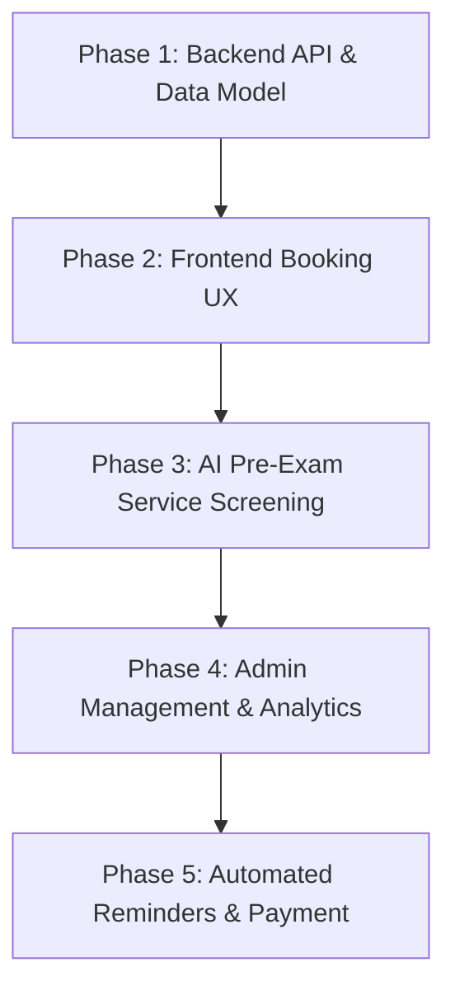

# Kế Hoạch Triển Khai Tính Năng "Khám Dịch Vụ" (Service-Based Medical Examination) - NovaCare

## 1. Tổng Quan Mục Tiêu
Tính năng **"Khám Dịch Vụ"** cho phép bệnh nhân chủ động đăng ký các dịch vụ y tế lẻ (Siêu âm, Xét nghiệm, Chẩn đoán hình ảnh, Nội soi, Khám chuyên khoa sâu) hoặc các Gói khám tầm soát sức khỏe tổng quát theo từng Cơ sở Y tế.

---

## 2. Phân Kỳ Triển Khai (Phases of Implementation)

---

### Phase 1: Cấu Trúc Dữ Liệu & Backend API (NestJS & Prisma)
- **Mục tiêu**: Đảm bảo toàn bộ thông tin chi phí, danh mục, thời lượng và ghi chú dịch vụ được quản lý chặt chẽ.
- **Nhiệm vụ cụ thể**:
  1. **Prisma Schema**:
     - Bổ sung trường category (`EXAMINATION`, `IMAGING`, `LABORATORY`, `ENDOSCOPY`, `FUNCTIONAL_TEST`), `preparationNote` (hướng dẫn nhịn ăn/uống nước), `estimatedResultTime` cho model `MedicalService`.
  2. **Service APIs**:
     - `GET /medical-services`: Lấy danh sách dịch vụ theo `hospitalId`, lọc theo chuyên khoa/nhóm dịch vụ.
     - `GET /medical-services/:id`: Lấy chi tiết dịch vụ kèm danh sách Bác sĩ/Phòng chức năng có thể thực hiện.
  3. **Booking Logic Integration**:
     - Cập nhật `AppointmentsService.create()` tính tổng chi phí `totalPrice = consultationFee + serviceFee`.
     - Tự động gán slot khả dụng của Bác sĩ hoặc Phòng dịch vụ trực ca.

---

### Phase 2: Giao Diện Người Dùng & Luồng Đặt Khám (Next.js Frontend)
- **Mục tiêu**: Trải nghiệm đặt khám 5 bước tối giản, minh bạch chi phí và thuận tiện.
- **Nhiệm vụ cụ thể**:
  1. **Trang Danh mục Dịch vụ (`/dich-vu`)**:
     - Hiển thị danh sách dịch vụ y tế phân theo nhóm (Siêu âm, Xét nghiệm, Chẩn đoán hình ảnh, Tầm soát).
     - Cho phép tìm kiếm nhanh theo tên dịch vụ, mức giá, bệnh viện.
  2. **Tích hợp Luồng Đặt Khám Cơ Sở (`/dat-kham-co-so`)**:
     - Step 1: Chọn hình thức "Khám Dịch Vụ / Xét Nghiệm".
     - Step 2: Mở `ServiceSelectModal` hiển thị bảng giá công khai, ghi chú chuẩn bị.
     - Step 3: Chọn Bác sĩ phụ trách chuyên khoa (hoặc hệ thống tự động gán Bác sĩ trực ca).
     - Step 4: Chọn Ngày khám (14 ngày tới) và Giờ khám theo buổi (**Sáng / Chiều / Tối**).
     - Step 5: Đặt chỗ & Thanh toán trực tuyến (VNPay / VietQR) hoặc Đăng ký giữ chỗ.

---

### Phase 3: AI Sàng Lọc & Gợi Ý Dịch Vụ Thông Minh
- **Mục tiêu**: Giúp bệnh nhân chưa rõ bệnh tình chọn đúng dịch vụ y tế cần thiết.
- **Nhiệm vụ cụ thể**:
  1. **Đo Nhịp Tim & Chỉ Số PPG qua Camera (`HeartRatePPGScanner.tsx`)**:
     - Phát hiện bất thường nhịp tim ➔ Gợi ý *Siêu âm tim Doppler* hoặc *Điện tâm đồ 12 chuyển đạo*.
  2. **AI Phân Tích Triệu Chứng & Ảnh Chụp (`AIAssistedBookingModal.tsx`)**:
     - Bệnh nhân nhập triệu chứng/tải ảnh ➔ AI GPT-4o chẩn đoán nguy cơ và tự động gợi ý *Gói khám/Dịch vụ phù hợp nhất*.

---

### Phase 4: Quản Lý Dịch Vụ Dành Cho Admin Bệnh Viện
- **Mục tiêu**: Cho phép Quản trị viên/Bệnh viện cập nhật bảng giá và theo dõi hiệu suất phòng khám.
- **Nhiệm vụ cụ thể**:
  1. **Trang Quản lý Dịch vụ (`/admin/medical-services`)**:
     - CRUD Dịch vụ y tế (Thêm/Sửa/Ẩn dịch vụ, cập nhật bảng giá, thời lượng).
  2. **Trang Quản lý Gói khám (`/admin/health-packages`)**:
     - Cấu hình danh mục dịch vụ trong từng gói khám sức khỏe tổng quát/VIP.
  3. **Thống kê & Báo Cáo Doanh Thu Dịch Vụ**:
     - Biểu đồ thống kê các dịch vụ được đặt nhiều nhất, tỷ lệ hoàn thành khám.

---

### Phase 5: Hướng Dẫn Chuẩn Bị & Nhắc Lịch Tự Động
- **Mục tiêu**: Giảm tỷ lệ bỏ khám (No-show) và đảm bảo bệnh nhân chuẩn bị đúng quy trình y tế.
- **Nhiệm vụ cụ thể**:
  1. **Thông báo Nhắc Lịch (SMS / Email / FCM Push)**:
     - Gửi thông báo trước 24h & 2h khám kèm **Lưu ý y tế** (ví dụ: *Vui lòng nhịn ăn sáng đối với dịch vụ Xét nghiệm máu / Nội soi*).
  2. **Mã QR Check-in**:
     - Xuất mã QR đơn đặt khám dịch vụ để bệnh nhân quét tại Cây tiếp đón tự động (Kiosk) ở bệnh viện.

---

## 3. Tiến Độ & Mốc Thời Gian Dự Kiến (Timeline)

| Tuần | Hạng mục công việc | Đầu ra (Deliverables) | Trạng thái |
| :--- | :--- | :--- | :--- |
| **Tuần 1** | Chuẩn hóa Data Model & Backend API | API CRUD MedicalService, seed 30 dịch vụ mẫu | ✅ Đã hoàn thành |
| **Tuần 2** | Xây dựng UI Đặt Khám Dịch Vụ & Popup Modal | `ServiceSelectModal`, Session Time Slots | ✅ Đã hoàn thành |
| **Tuần 3** | Triển khai AI Sàng lọc & Đề xuất dịch vụ | `AIAssistedBookingModal`, PPG Camera Scanner | ⏳ Đang triển khai |
| **Tuần 4** | Admin Portal & Báo cáo Doanh thu | Module Quản lý Dịch vụ Admin, Export báo cáo | ⏳ Kế tiếp |
| **Tuần 5** | Tích hợp Nhắc lịch tự động & Check-in QR | SMS/FCM Reminder, QR Code tiếp đón | ⏳ Kế tiếp |
