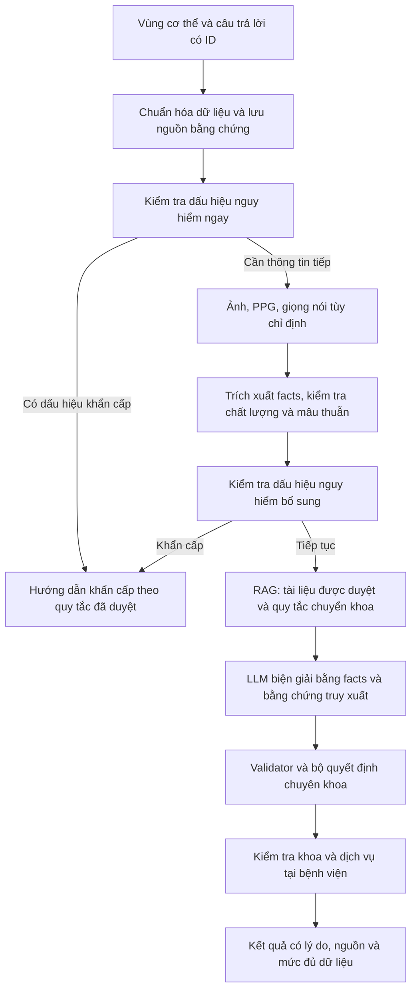

# Kế hoạch sửa AI sàng lọc và triển khai RAG + LLM

Ngày rà soát: 29/09/2026. Phạm vi: code hiện có của modal AI trên web và API `pre-exam-v2/analyze-smartphone`. Đây là tài liệu phân tích và kế hoạch; chưa thay đổi logic ứng dụng, chưa gọi API AI thật, chưa kiểm chứng lâm sàng.

## 1. Kết luận từ code

Cần sửa đường truyền dữ liệu, chuẩn hóa vùng cơ thể và cách xử lý lỗi trước khi đánh giá chất lượng mô hình. RAG hiện tại chỉ tìm chuyên khoa gần nhất, chưa cung cấp bằng chứng y khoa cho LLM. Đổi model hoặc tăng trọng số RAG chưa giải quyết được các lỗi dưới đây.

Đường chạy thực tế:

`BodyDiagram → ScreeningStep2 → AIAssistedBookingModal → analyze-smartphone → ClinicalFeatureExtractor → RedFlagEngine / PatternEngine → LLM tóm tắt → searchSpecialtyRAG → SpecialtyRecommendationEngine → ICD resolver → UI → booking`.

`AiScreeningOrchestratorService` đã tồn tại nhưng endpoint này không gọi `orchestrateScreening`; normalizer và validator trong orchestrator không bảo vệ đường chạy đang dùng. Không nên chỉ chuyển endpoint sang orchestrator cũ: bộ tính nguy cơ trong đó nâng mọi `hasRedFlag`, kể cả URGENT, thành EMERGENCY; normalizer cũng có ánh xạ vùng chưa đầy đủ.

| Ưu tiên | Phát hiện xác minh trong code | Hệ quả | Điểm sửa |
|---|---|---|---|
| P0 | `AIAssistedBookingModal.tsx:660`: `onCompleted(result)` chỉ toast, không lưu `result.answers`. Request tại dòng 486 chỉ chứa state cũ. | Câu trả lời trắc nghiệm và cảnh báo ở bước 2 không đến backend. | Lưu câu trả lời có ID/version; backend ánh xạ và tính lại. |
| P0 | State đau mặc định 4, thời gian dưới 24 giờ; chiều cao/cân nặng mặc định 168/62. Không có cập nhật pain/duration từ kết quả bước 2. | Dữ liệu mặc định bị coi là thông tin người bệnh. | Ban đầu là null; chỉ gửi dữ liệu được xác nhận. |
| P0 | `clinical-feature-extractor.service.ts:24`: dùng chuỗi con để nhận diện vùng. | Mất các mã knee/ankle/hand/shoulder; tay phải bị đổi thành trái; cổ và họng chưa tách rõ. | Một danh mục vùng có mã, bên, mặt trước/sau và bảng ánh xạ đầy đủ. |
| P0 | `clinical-feature-extractor.service.ts:56`: keyword không xử lý phủ định. | “Không khó thở” thành có khó thở; `ho` khớp cả trong từ khác. | Câu trả lời có kiểu dữ liệu; facts văn bản có polarity và đoạn nguồn. |
| P0 | `AIAssistedBookingModal.tsx:517`: lỗi API sinh kết quả fallback; dòng 565 dùng `specialties[0]` nếu không khớp. | Lỗi dịch vụ bị che thành kết quả sàng lọc; đặt sai khoa. | Trả trạng thái lỗi/thiếu dữ liệu, không tạo recommendation thay thế tùy ý. |
| P0 | `HeartRatePPGScanner.tsx:349`: thêm jitter; dòng 368 mô phỏng khi không có camera; dòng 385 fallback 75. Prompt/UI cũng dùng 75 khi thiếu số đo. | Số giả hoặc số chưa đủ chất lượng trở thành dữ liệu lâm sàng. | Không tạo BPM khi đo thất bại; metadata chất lượng bắt buộc; demo không được dùng để tính sàng lọc. |
| P0 | Web gửi media bằng `session-${Date.now()}` nhưng backend yêu cầu session DB tồn tại. Catch vẫn toast thành công. | Upload có thể thất bại nhưng UI báo đã lưu. Blob còn được gửi lại ở request phân tích, nên không thể kết luận mọi đường STT đều hỏng. | Session thật, media ID thật, trạng thái xử lý rõ ràng, không upload/STT lặp. |
| P1 | `pre-exam-v2.service.ts:321`: LLM chạy trước RAG; RAG chỉ nhận symptoms hoặc tên vùng. | Không sử dụng đầy đủ câu trả lời/ảnh/voice trong truy xuất; LLM không được cung cấp tài liệu. | Truy xuất theo facts chuẩn hóa trước bước biện giải. |
| P1 | `medical-rag.service.ts`: vector của tên/mô tả chuyên khoa, cộng keyword và ngưỡng 0.30; lỗi embedding đổi sang hash ký tự. | Không có căn cứ cho ngưỡng độ tin cậy; có thể trộn vector hash và vector model cùng số chiều nhưng khác không gian. | Kho tài liệu có nguồn/version; chỉ so vector cùng model/version; lỗi trả retrieval unavailable. |
| P1 | Tóm tắt lấy từ LLM, khoa lấy từ engine; `clinicalPatterns` LLM không tham gia scoring. Pattern ENT có nhưng scorer không có nhánh ENT tương ứng. `symptomScore = patternScore * 0.9`. | Tóm tắt và khoa không thống nhất; trùng tính bằng chứng; phạm vi chuyên khoa chưa cân đối. | Quyết định chung có evidence IDs; tóm tắt sinh sau quyết định; mở rộng mapping theo dữ liệu được duyệt. |
| P1 | Ảnh được lưu thành `imageFindings` nhưng engine pattern/scoring hiện không dùng nội dung này; loại ảnh suy từ tên file. | Ảnh có thể ảnh hưởng văn bản LLM mà không ảnh hưởng khoa; filename không phải bằng chứng loại tổn thương. | Vision có schema, vùng chụp do người dùng chọn, kiểm tra liên quan/chất lượng. |
| P1 | Khoa truy vấn toàn DB, không lọc hospital ở scorer. | Khoa có thể không có tại bệnh viện đang đặt. | Tách khoa phù hợp lâm sàng và khả năng đặt tại bệnh viện. |
| P1 | `icd-candidate-resolver.service.ts:33`: `matchesSpecialty || matchesKeyword`, lấy bản ghi đầu tiên trong catalog hardcode. | Có thể đổi tên khả năng y tế sang bệnh khác chỉ vì cùng khoa. | Tạm bỏ ICD khỏi kết quả người dùng; chỉ map thuật ngữ có nguồn sau khi kiểm chứng. |
| P1 | Đường API chỉ trả EMERGENCY hoặc CONSULT, bỏ mất URGENT; thiếu red flag đau đầu đột ngột tương ứng câu hỏi web. | Cảnh báo bước 2 và kết quả cuối có thể khác nhau. | Một bộ quy tắc server có version, mức độ và điều kiện rõ ràng. |
| P1 | Key dự phòng được hardcode trong hai service; `hasApiKey()` luôn true. | Cấu hình sai bị che; có credential trong mã nguồn. | Thu hồi/đổi key đã lộ, đưa vào secret/env, bỏ log một phần key, không ghi triệu chứng thô vào log thường. |

Nhận định về prompt: schema ví dụ chứa riêng tình huống đau thành ngực/viêm sụn sườn cho mọi vùng. Đây là nguy cơ thiên lệch ví dụ, chưa phải nguyên nhân đã đo được từ request thực tế. Thay bằng schema trung tính và bộ eval theo vùng.

## 2. Kết quả kiểm tra cục bộ

Chạy ba suite hiện có: `pre-exam-v2.spec.ts`, `test/head-screening.spec.ts`, `test/chest-screening.spec.ts`: **6/6 test đạt**. Các bài này chủ yếu truyền dữ liệu trực tiếp vào engine, không kiểm tra hợp đồng UI → HTTP → backend.

Chạy trực tiếp extractor/resolver bằng ts-node, không gọi AI/DB:

| Input | Output thực tế |
|---|---|
| `bodyAreas: ['left_knee']` | `[]` |
| `bodyAreas: ['right_ankle']` | `[]` |
| `bodyAreas: ['left_hand']` | `[]` |
| `bodyAreas: ['right_upper_arm']` | `['LEFT_ARM']` |
| `Không khó thở, không ho, không ngất` | `dyspnea=true, cough=true, syncope=true` |
| Candidate `Đau đầu`, specialty `Cơ xương khớp` | `Đau khớp / Viêm khớp thành ngực`, mã `M25.5` |

Đây là bằng chứng lỗi logic, không phải đánh giá độ chính xác y khoa của toàn sản phẩm. Ảnh chụp UI chưa có kết quả cuối hay response nên chưa xác định lỗi nào đã xuất hiện trong phiên cụ thể của người dùng.

## 3. Kiến trúc đề xuất

Phân định trách nhiệm:

- **Rules server:** tính mức khẩn cấp từ thông tin đã xác nhận, không chờ LLM/media nếu đã có cảnh báo đủ điều kiện. Kết quả LLM không được hạ mức cảnh báo.
- **LLM trích xuất:** biến lời mô tả/transcript thành facts; giữ phủ định, thời điểm, người có triệu chứng và nguồn. Không biến việc đọc câu mẫu thành triệu chứng thật.
- **RAG:** tìm đoạn hướng dẫn phù hợp với facts và các câu hỏi cần hỏi thêm. Tài liệu giải thích kiến thức, không phải bằng chứng rằng người dùng có triệu chứng trong tài liệu.
- **LLM biện giải:** đề xuất khoa trong danh mục ứng viên, mỗi lý do gắn fact IDs và chunk IDs. Không tự tạo specialty ID, không đưa chẩn đoán xác định.
- **Validator/decision engine:** kiểm tra evidence, tính hợp lệ của khoa, mâu thuẫn, dữ liệu thiếu; quyết định `ASK_MORE`, `REVIEW_REQUIRED`, `RECOMMEND` hoặc `EMERGENCY_GUIDANCE`.
- **Booking resolver:** xác định có khoa/dịch vụ phù hợp ở bệnh viện này không. Nếu không có, thông báo và cho đổi cơ sở; không đổi kết luận sang khoa bất kỳ đang có.

Vùng đau là thông tin định hướng; không ép mỗi vùng vào một chuyên khoa duy nhất. Một vùng có thể liên quan nhiều cơ quan, và triệu chứng lan/đi kèm có thể dẫn tới khoa khác. Mọi ngoại lệ cần lý do truy được về facts, tránh cả hai lỗi “vùng nào khoa đó” và “bỏ qua vùng đã chọn”.

## 4. Điều chỉnh năm bước thu thập

| Bước | Thiết kế mới | Dữ liệu được dùng |
|---|---|---|
| 1. Vùng đau | Mã vùng chi tiết, trái/phải, trước/sau; chọn triệu chứng chính; tuổi/nhóm tuổi và thông tin hồ sơ liên quan do người dùng xác nhận. Giới tính của hình minh họa không tự trở thành giới tính bệnh nhân. | Region IDs và complaint riêng cho từng vùng. |
| 2. Trắc nghiệm | Câu hỏi nguy hiểm trước; câu hỏi phân biệt nguyên nhân sau; ngân hàng câu hỏi có chuyên môn duyệt. Có “không rõ”; bỏ qua khác “không”. Đổi vùng phải vô hiệu hóa câu hỏi/kết quả cũ theo version. | `questionId`, typed value, version, answeredAt; server tự tính red flags. |
| 3. Ảnh | Chỉ mời khi có tổn thương nhìn thấy và người dùng muốn cung cấp. Yêu cầu vùng chụp, blur/lighting/occlusion, ảnh có liên quan không; ảnh tài liệu tách luồng OCR riêng. | Quan sát mô tả có nguồn và chất lượng, không kết luận bệnh nội tạng từ ảnh da. |
| 4. PPG | Tùy chọn, ưu tiên khi thông tin này hữu ích; đo theo timestamp thực, kiểm tra nhiễu/chuyển động/số chu kỳ, không jitter hoặc clamp thành giá trị có vẻ bình thường. | BPM ước lượng + thời lượng + trạng thái chất lượng + nguồn đo; thiếu/đo lỗi là null. Không dùng để kết luận loại rối loạn nhịp hay loại trừ tình trạng khẩn cấp. |
| 5. Giọng nói | MVP dùng STT lời kể triệu chứng, cho người dùng xem/sửa/xác nhận. Nếu dùng đoạn đọc để nghiên cứu độ khàn, phải tách task và dữ liệu đánh giá riêng. | Transcript được xác nhận; không suy bệnh cổ họng chỉ từ văn bản của câu đọc mẫu. |

Không yêu cầu hoàn thành ảnh/PPG/voice khi không liên quan hoặc khi có cảnh báo cần hỗ trợ ngay. Giao diện có thể giữ các tab hiện tại hoặc tách PPG/voice thành hai bước và đưa kết quả ra màn riêng.

## 5. Hợp đồng dữ liệu chung cho web/mobile

`ScreeningInputV3` gồm:

- `schemaVersion`, `sessionId`, `inputRevision`, `questionnaireVersion`, `hospitalId`, `patientProfileId?`.
- `patientContext`: age/ageGroup, thông tin liên quan và cờ đã xác nhận; thiếu thì null, không tự dùng hồ sơ mặc định của tài khoản khi đang đặt cho người thân.
- `complaints[]`: id, primary, regionId, laterality, view, onset/duration, severity, symptomCodes.
- `answers[]`: questionId, value (boolean/enum/number/null), status (`ANSWERED`, `UNKNOWN`, `SKIPPED`), complaintId.
- `media[]`: mediaId, complaintId, modality, purpose, status, quality, consent/retention metadata.
- `ppg`: bpm/null, source, quality, durationMs, measuredAt, algorithmVersion; `SIMULATED` bị loại khỏi quyết định.
- `voice`: mediaId, transcript, transcriptConfirmed, purpose (`SYMPTOM_NARRATIVE` hoặc `READING_SAMPLE`).

Server ánh xạ answers theo question registry. Không tin điểm nguy cơ hoặc kết luận khoa do client gửi. Chỉ nhận question IDs/version hợp lệ; thu hồi kết quả khi revision thay đổi; response muộn từ revision cũ không được cập nhật UI.

`ClinicalFact` có `id`, `conceptCode`, `value`, `polarity` (`PRESENT`, `ABSENT`, `UNKNOWN`), complaintId, sourceType, sourceId, sourceSpan, temporality, subject, quality. Câu trả lời đã xác nhận có ưu tiên hơn suy diễn từ text; khi hai nguồn mâu thuẫn thì hỏi lại, không âm thầm ghi đè.

`ScreeningResultV3` gồm triage level/action, primary/alternative specialties hoặc null, supporting/contradicting evidence IDs, missingQuestionIds, modalityStatuses, citations, hospitalAvailability, rulesVersion, knowledgeVersion và model/prompt version. Điểm xếp hạng hoặc cosine similarity không được gắn nhãn “xác suất đúng bệnh”.

## 6. Xây RAG đúng mục đích

Ưu tiên tận dụng PostgreSQL đang có với pgvector; chưa cần thêm vector DB riêng. pgvector hỗ trợ phối hợp vector search và PostgreSQL full-text search, hợp nhất bằng RRF hoặc reranker. Với tiếng Việt phải thử normalization, từ đồng nghĩa và tách từ trên tập eval; không mặc định full-text search xử lý tiếng Việt tốt sẵn. [Tài liệu pgvector](https://github.com/pgvector/pgvector#hybrid-search).

Tách hai kho:

1. **Kho tri thức y khoa được duyệt:** triệu chứng, câu hỏi phân biệt, dấu hiệu nguy hiểm, tiêu chí chuyển khám; tài liệu Bộ Y tế, hướng dẫn bệnh viện và nguồn chuyên môn như NICE/WHO theo phạm vi áp dụng và quyền sử dụng.
2. **Danh mục vận hành:** specialty code/ID, dịch vụ, cơ sở, độ tuổi tiếp nhận, lịch bác sĩ; truy vấn DB trực tiếp cho tình trạng hiện tại, không coi embedding là nguồn xác thực lịch trống.

Ingestion: nhập nguồn được chọn → làm sạch/OCR → chuyên môn duyệt → chia theo mục khuyến nghị có đủ điều kiện/ngoại lệ → gắn metadata → embedding bằng một model/version → publish snapshot. Thu hồi/reindex khi tài liệu đổi; không index dữ liệu bệnh nhân vào kho dùng chung.

Metadata tối thiểu: `documentId`, `sourceUrl`, `title`, `issuer`, `section`, `publishedAt`, `reviewedAt`, `version`, `language`, `regionCodes`, `specialtyCodes`, `ageRange`, `pregnancyApplicability`, `evidenceType`, `reviewStatus`, `license`, `contentHash`, `embeddingModel`, `embeddingDimensions`.

Schema dự kiến: `MedicalDocument`, `MedicalChunk`, `ClinicalRule`, `ScreeningQuestion`, `SpecialtyClinicalMapping`, `ScreeningRun`, `ScreeningEvidence`. Vector column/index dùng migration SQL tương thích môi trường PostgreSQL thực tế; xác minh extension trước khi migration. Chưa cố định số chiều trước khi chọn và kiểm tra embedding model.

Retrieval runtime:

1. Tạo query từ complaint chính, triệu chứng hiện có/âm tính quan trọng, diễn tiến, nhóm tuổi và findings đủ chất lượng. Không lấy văn bản câu hỏi chưa trả lời làm triệu chứng.
2. Hard filter nguồn đã duyệt/version/phạm vi bệnh nhân. Vùng cơ thể thường là ưu tiên mềm để không mất tài liệu về triệu chứng lan; mở rộng có kiểm soát khi recall thấp.
3. Hybrid search lấy tập ứng viên (khởi điểm khoảng 20); rerank còn 4–8 đoạn có điều kiện/ngoại lệ đầy đủ, khử trùng lặp. Đây là thông số thử nghiệm, phải chọn lại qua eval.
4. Kiểm tra bằng chứng phù hợp/đủ; thấp thì hỏi thêm hoặc yêu cầu đánh giá trực tiếp. Không diễn giải retrieval thấp thành “không phải vấn đề y tế” hoặc “an toàn ở nhà”.
5. Gửi facts và đoạn nguồn vào LLM; lưu chunk IDs/version để tái hiện. Treat nội dung nhập/tài liệu là dữ liệu, không thực thi chỉ dẫn bên trong.

## 7. Ràng buộc LLM và xử lý lỗi

Giữ adapter cho nhà cung cấp đang dùng, tách tác vụ text/vision/STT/embedding. Code đang dùng OpenAI SDK với base URL trung gian; tên model trong env không chứng minh năng lực thực tế của gateway. Trước triển khai cần contract test hỗ trợ ảnh, âm thanh, embeddings, output schema, timeout/refusal; không cần đổi model trước khi có số đo.

Ưu tiên JSON Schema strict nếu endpoint/model thực sự hỗ trợ. `json_object` hiện tại chỉ đảm bảo dạng JSON, không đảm bảo schema; vẫn phải validate server và kiểm tra nội dung/evidence. [OpenAI Structured Outputs](https://developers.openai.com/api/docs/guides/structured-outputs).

Prompt chỉ có facts được xác nhận, danh mục ứng viên và tài liệu truy xuất. Loại các giá trị giả 75 BPM/BMI 22.0 và ví dụ bệnh riêng lẻ áp dụng cho mọi ca. Bắt buộc phân biệt chưa biết và âm tính, trích evidence IDs, cho phép không đủ thông tin; không yêu cầu chuỗi suy nghĩ nội bộ.

Tóm tắt cuối phải dựa trên **quyết định đã validate** và cùng tập facts; có thể dùng template cho MVP. Kiểm tra bất nhất giữa summary, urgency và specialty trước khi render.

Khi LLM/RAG/media lỗi: lưu mã lỗi/trạng thái thiếu, giữ quy tắc khẩn cấp đã xác minh, cho thử lại hoặc đi tiếp với thông tin còn đủ. Nếu không đủ thì `ASK_MORE`/`REVIEW_REQUIRED`. Không tự sinh kết quả ảnh, transcript hay recommendation để UI trông thành công.

## 8. Thứ tự triển khai và tiêu chí hoàn thành

| Giai đoạn | Công việc và file chính | Tiêu chí hoàn thành |
|---|---|---|
| A. Sửa dữ liệu | Modal, ScreeningStep2, bodyRegions, DTO API, extractor; bỏ fallback sai, sửa apply recommendation, media session và PPG giả. | Câu trả lời bước 2 đến server đúng; mọi mã vùng UI được map; giữ bên; thiếu dữ liệu là null; ID khoa không khớp không thể áp dụng. |
| B. Hợp nhất sàng lọc | Refactor PreExamV2Service gọi một orchestrator đã sửa; registry questions/rules/version; dùng chung contracts web/mobile. | Cùng payload luôn cùng quyết định rules; cảnh báo không bị mất giữa bước 2 và kết quả; URGENT/EMERGENCY thống nhất. |
| C. Kho RAG | Migration/schema, pipeline ingest/review, retrieval, versioning, nguồn dẫn. | Mỗi chunk truy được nguồn; không trộn embedding; đo được recall theo từng nhóm triệu chứng; chưa đủ nguồn thì abstain. |
| D. Tích hợp LLM | Provider adapter, extract facts, structured synthesis, evidence validator, hospital resolver. | Không bịa fact/specialty/citation; có ASK_MORE; summary khớp quyết định; khoa không có tại viện được báo đúng. |
| E. Kiểm định | Contract/E2E tests, corpus do người có chuyên môn gán nhãn, chế độ chạy đối chiếu chưa áp dụng vào đặt khám, theo dõi lỗi và rollback. | Đạt các ngưỡng chất lượng đã thống nhất; không coi unit test đạt là chứng nhận an toàn lâm sàng. |

Triển khai A trước; B và tập đánh giá là nền tảng trước khi đưa C/D vào luồng thực tế. Dùng feature flag để so bản mới với baseline trên dữ liệu được phép sử dụng. Không cần framework agent phức tạp cho MVP; pipeline có thứ tự trong NestJS dễ truy vết hơn.

## 9. Bộ đánh giá phải có

- Contract/E2E: câu hỏi → answer → payload → fact → red flag → kết quả → specialty ID đặt khám; đổi vùng/đổi hồ sơ phải vô hiệu hóa kết quả cũ.
- Regression: các lỗi tái hiện ở mục 2; boolean false/0/null; tiếng Việt có/không dấu; phủ định kép, tiền sử, lời nói về người khác, nhiều vùng.
- Sàng lọc: cùng một vùng nhưng các tổ hợp triệu chứng dẫn tới nhiều khoa; đầu/ngực/bụng/da/tai-mũi-họng/cơ-xương-khớp; các nhóm tuổi hoặc thai kỳ chưa có nội dung được duyệt phải có giới hạn phạm vi rõ ràng.
- Cảnh báo: câu hỏi `head_q1` dương tính không bị mất ở kết quả cuối; trường hợp bỏ trống không được coi là âm tính. Nội dung và hành động cảnh báo phải do người có chuyên môn xác nhận. NICE CG150 có đề cập đau đầu khởi phát đột ngột đạt mức tối đa trong 5 phút là lý do xem xét đánh giá/chuyển tuyến thêm; không sao chép nguyên quy tắc cho mọi độ tuổi. [NICE CG150](https://www.nice.org.uk/guidance/cg150/chapter/Recommendations).
- Media: từ chối camera, ảnh mờ/không liên quan, audio im lặng, chỉ đọc mẫu, PPG nhiễu; lỗi 429/timeout/JSON sai/refusal; không tạo bằng chứng thành công giả.
- RAG: nguồn sai nhóm tuổi, tài liệu hết hiệu lực, vector model khác version, không tìm thấy, prompt injection trong text/OCR, citation không thuộc tập truy xuất.
- Booking: khoa không có tại viện, inactive, không có dịch vụ/lịch phù hợp; không rơi về khoa đầu tiên.

Khởi điểm xây 150–300 tình huống chuẩn có người chuyên môn duyệt; mở rộng theo độ phủ, không coi số lượng này là đủ xác nhận lâm sàng. Tách tập chỉnh prompt/rules và tập đánh giá giữ kín; biến thể của cùng ca không rải sang cả hai tập.

Đo riêng: độ nhạy cảnh báo + tỷ lệ cảnh báo quá mức, mức phù hợp top-1/top-3 chuyên khoa, tỷ lệ từ chối kết luận khi thiếu dữ liệu, recall@k của retrieval, tỷ lệ trích dẫn có hỗ trợ, tỷ lệ bịa fact, độ nhất quán kết quả, latency p50/p95 và chi phí mỗi phiên. Báo kết quả theo vùng/nhóm người dùng, mẫu số và khoảng bất định; không gộp thành một điểm accuracy.

Điều kiện kỹ thuật cứng: 100% mã vùng được xử lý, không ID khoa giả, không BPM/transcript/ảnh giả, không hạ cảnh báo rules, không citation ngoài tập nguồn. Ngưỡng hiệu năng lâm sàng phải được thống nhất và đánh giá độc lập; đạt 100% regression chỉ chứng minh các ca đã kiểm thử.

## 10. Dữ liệu sức khỏe và vận hành

Media/session hiện có endpoint public; cần kiểm tra quyền sở hữu hoặc token phiên khách có phạm vi cho upload/read/delete. Chỉ tạo quyền truy cập media theo phiên; TTL và xóa thực tế phải khớp lời hứa trên UI. Consent cần nói rõ dữ liệu nào được gửi tới nhà cung cấp AI, thời gian lưu và mục đích; không chỉ xin quyền camera của trình duyệt.

Lưu audit theo phiên bản và ID bằng chứng, hạn chế nội dung nhận dạng; log kỹ thuật không chứa API key, ảnh/audio hay toàn bộ triệu chứng. Không lấy người dùng đầu tiên trong DB để gán phiên ẩn danh. Các thay đổi này cần đưa vào thiết kế session chung, kể cả nếu MVP chỉ mở modal đặt khám.

WHO nêu rủi ro thông tin sai, thiên lệch và lệ thuộc kết quả của mô hình đa phương thức; khuyến nghị có chuyên môn y tế và người dùng tham gia thiết kế/đánh giá. Với NovaCare, áp dụng bằng phạm vi sàng lọc rõ ràng, nguồn đã duyệt và kiểm định trước khi dùng kết quả để điều hướng bệnh nhân. [WHO guidance overview](https://www.who.int/news/item/18-01-2024-who-releases-ai-ethics-and-governance-guidance-for-large-multi-modal-models).
